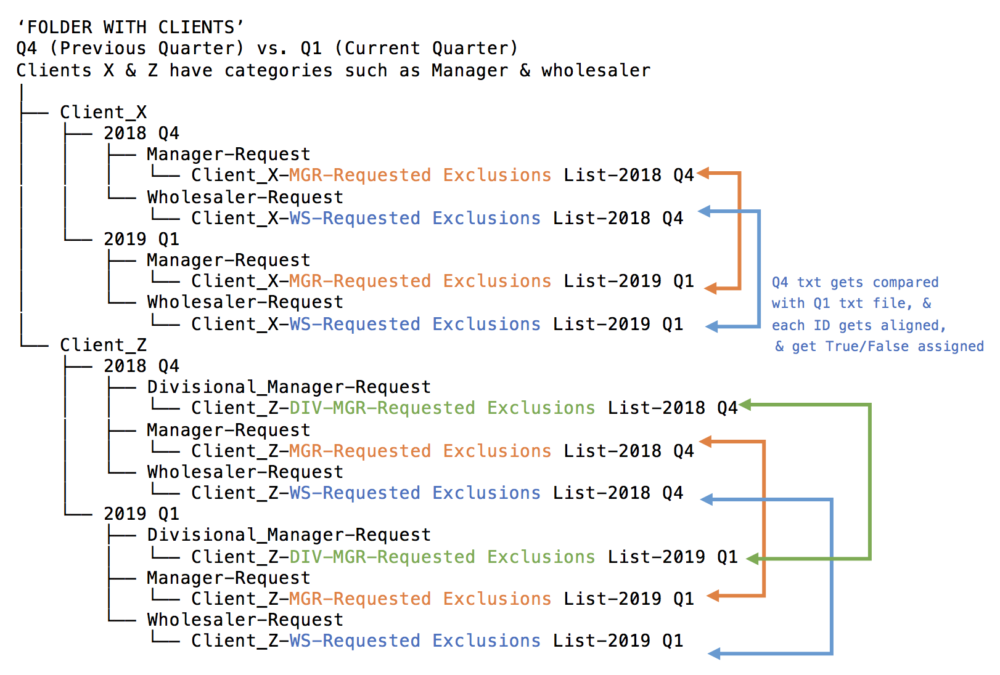

# Text File Comparer Automation Project

### Introduction

One of the Data Analysts' task was to compare several text files by manually manipulating data on Microsoft Excel (spreadsheet) 
prior to updating the Market Metrics mobile application. At the beginning of each quarter, every ‘iPad’ client would deliver a list 
of their ‘Exclusion IDs’ or ‘BDE IDs’ that were related to certain data/transactions that each client did not want to see in their 
account linked with the Market Metrics app. As part of the process, these lists (or txt files) containing the BDE IDs were compared 
to those lists submitted by each iPad client during the previous quarter. This automation process using Python, reduced some of the 
work done manually by analysts.

### NOTE 1:
The Text File Comparer Automation Project does not include a writing sample. Please note that the script will not run on your computer 
since the data gets extracted from a file path within the author’s personal laptop. However, the automation code includes notes or 
comments that clearly explain each step and the logic behind every code line.

### NOTE 2: 
Dummy data was used to generate exclusion IDs, meaning that these are not relevant and do NOT hold any value for any 
employer, organization or institution. The goal of this project is to mimic an algorithm based on another 
experiment/prototype.

### TEXT COMPARER GIF

### How do analysts ran this code?
They simply open an IDE; ran the code & then had to enter the following: client's name, & the pair of quarters being compared.

### Testing Folder Directory Tree

### What's included in this repository?

1. Automation_Script.py (TEXT FILE COMPARER - comments included within the code)
2. Text_File_Comparer_Automation_Project.pptx

### Technologies

1. Microsoft Office:
	* Microsoft PowerPoint
2. Python 3 (via PyCharm CE - IDE)
